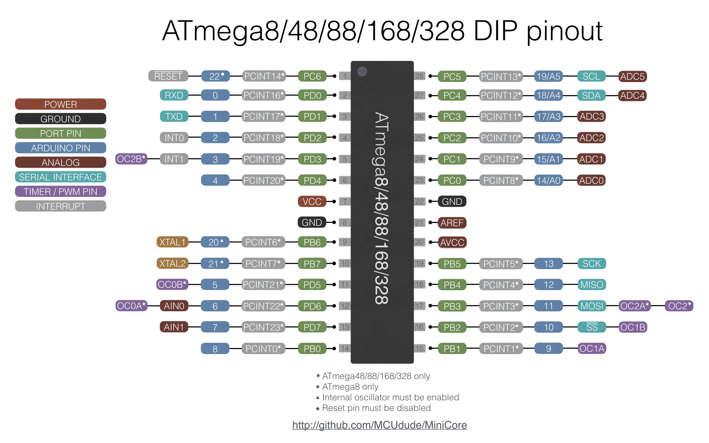

# Arduino on a Breadboard
## Assignment's description
Use the ATmega328 to build Arduino on a Breadboard
## Documentation
bullet point list
* Basic knowledge of ATmega328
* Connect the circuit
* Use the Arduino IDE test the circuit

numbered list

**Basic knowledge of ATmega328**

**1.All of the supplies**

To make an arduino on a breadboard,what we need is all there.

**2.Add ATmega328**

Firstly,we plug the ATmega328 which is the core of the arduino into the breadboard.

**3.Add two wires**

Use two lines to link the two sides of the breadboard,assuring current can flow on both sides.

**4.Add voltage regulator**

Plug the Voltage Regulator and the capacitor to the breadboard,which can reduce the voltage from the external battery if the voltage is too high. And the capacitor can stablize the voltage in circuit. 

**5.Add a LED**

Plug one LED to the breadboard to detect if there have current in circuit and then to know when the ATmega328 is powered.

**6.Add supporting power**

Use wires to make sure that current can flow into the ATmega328. And use a resistence(10k) to prevent the chip from resetting itself during normal operation.

**7.Add a crystal oscillator**

Add a crystal oscillator between the Pin9 and10,and add 2 capacitors(22pf) between ground and the two Pins.

**8.Add a USB**

Use a USB(CP2120) link the computer and the board. The connection order is "VCC to +;GND to -;RXD to Pin3(TXD on the ATmega328);TXD to Pin2(RXD on the ATmega328);DTR to Pin1 and between the two need a capacitor.

**9.Current can flow**

Connect the USB to the computer,the LED is on,to illustrate that current can correctly flow.

**10.Control LED**

Use the Pin19 on the ATmega328(Pin13 on the Arduino Uno) to control the LED to flash. And the code is from case in Arduino IDE.

**11.Adrduino IDE**

Code test on Arduino IDE

