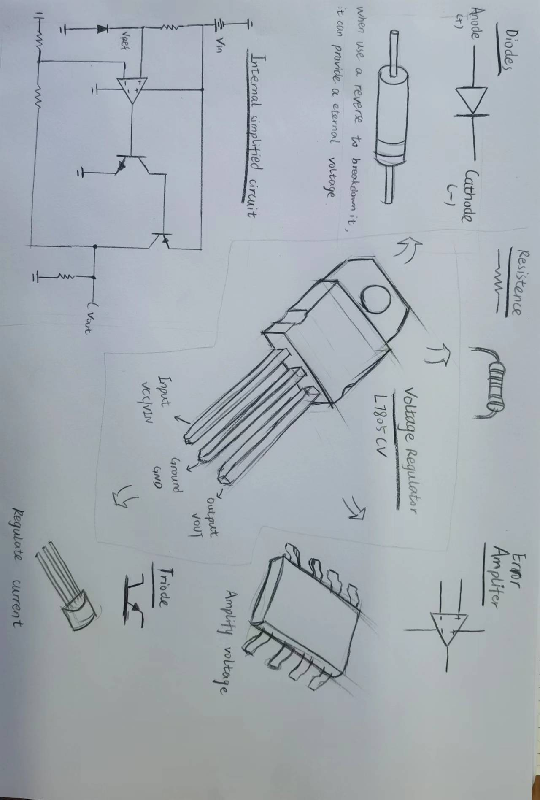

# Hand-sketching components

## Assignment's description
Make a hand-drawn sketch of the basic electronic components used on the Arduino on a Breadboard.

## Documentation
I choose the Voltage Regulator to make a hand-drawn sketch

bullet point list
* Important Components
* How it works

numbered list
1. Diodes
2. Error Amplifuer
3. Triode
4. Resistence
5. Internal simplified circuit

