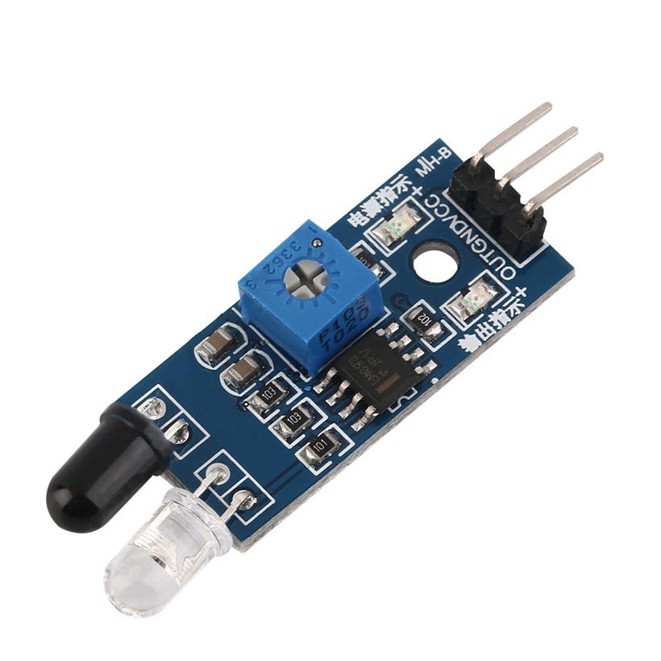
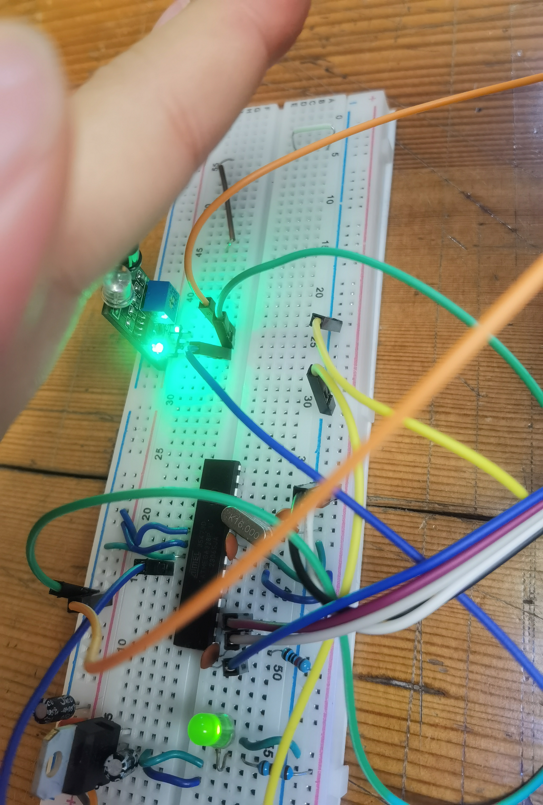
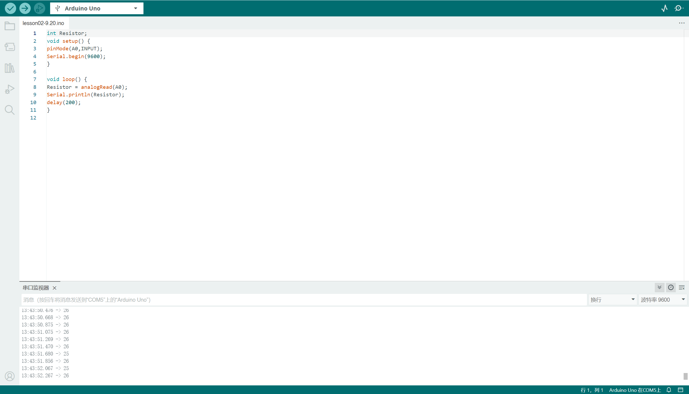
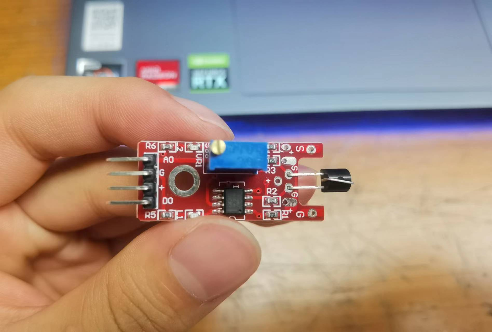
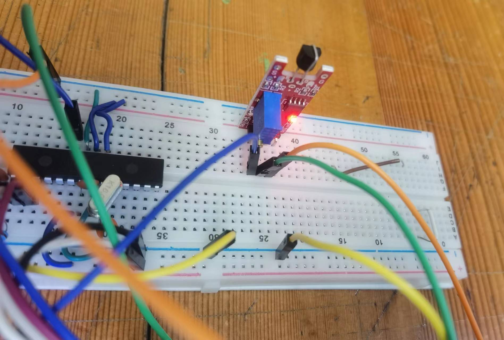

# Input devices try-out

## Assignment's description
Experience data collection with digital and analog input devices. Pick one sensor from a collection and try it out with the prototyping breadboard. Connect the sensor to the suitable pin-headers and test it with a program. Read the sensor’s data using the Serial Monitor. Repeat the exercise with one digital and one analog sensors. Understand how the sensor works and how data is collected and used.

## Documentation
I choose the digital sensors include an infraded obstacle avoidance sensor and a touch sensor,and one analog sensor that is soil moisture sensor.

**infraded obstacle avoidance sensor**

The infraded obstacle avoidance sensor can detect if there has some obstacles,it can generate a low potential when I put my hand close to it,and a high potential if there is no obstacle.

**Touch sensor**

That touch sensor can output digital or analog signal,when use the pin DO,the serial monitor can only receive 1 if we touch the sensor.When we use the pin AO,we can receive dignal from 0 to 1023,and it represent the amount of the pressure.

