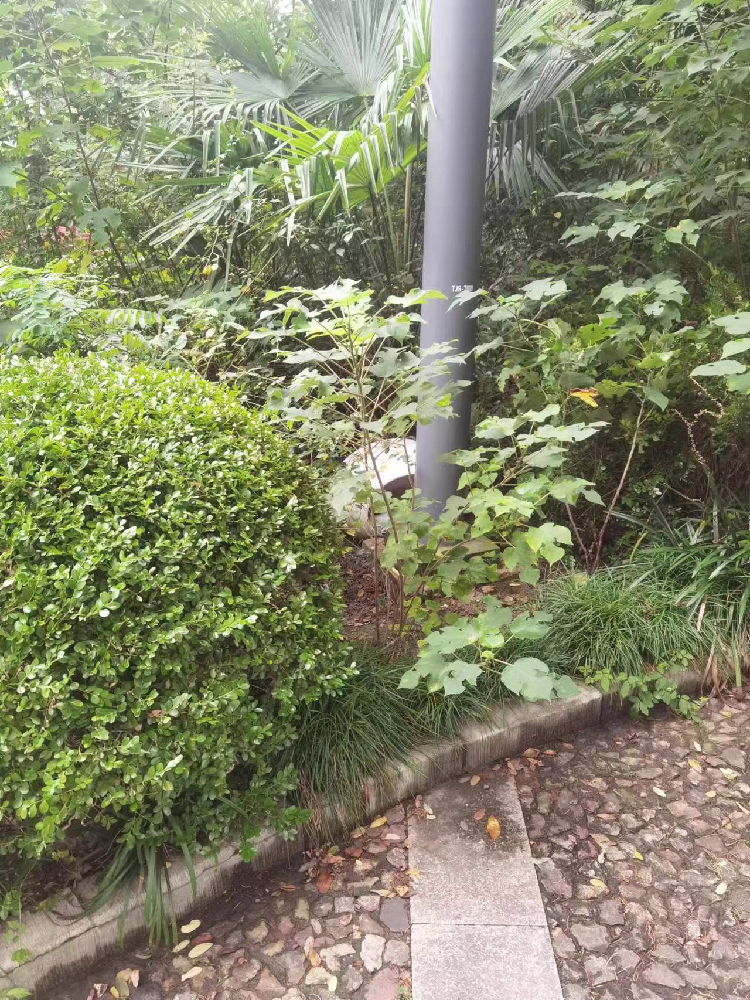
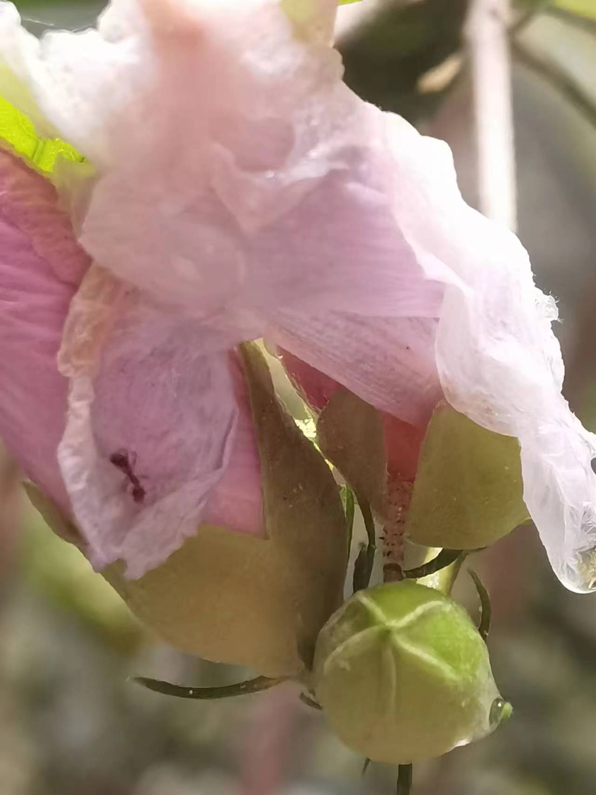
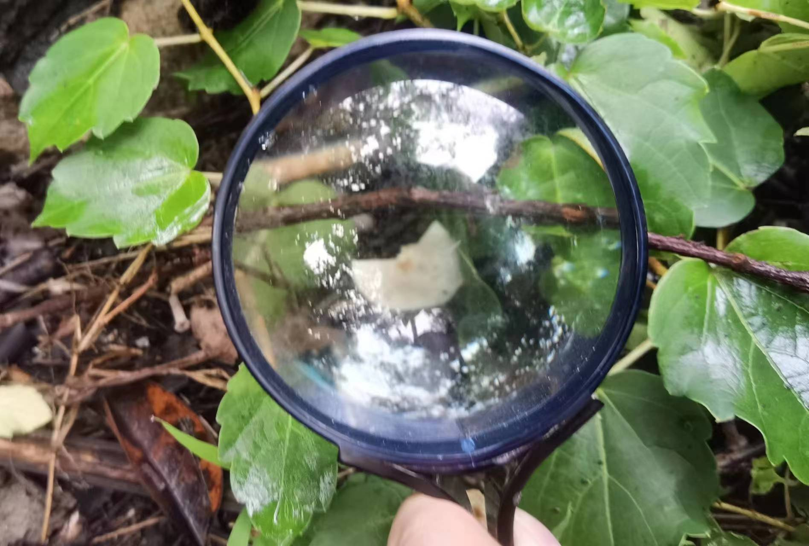
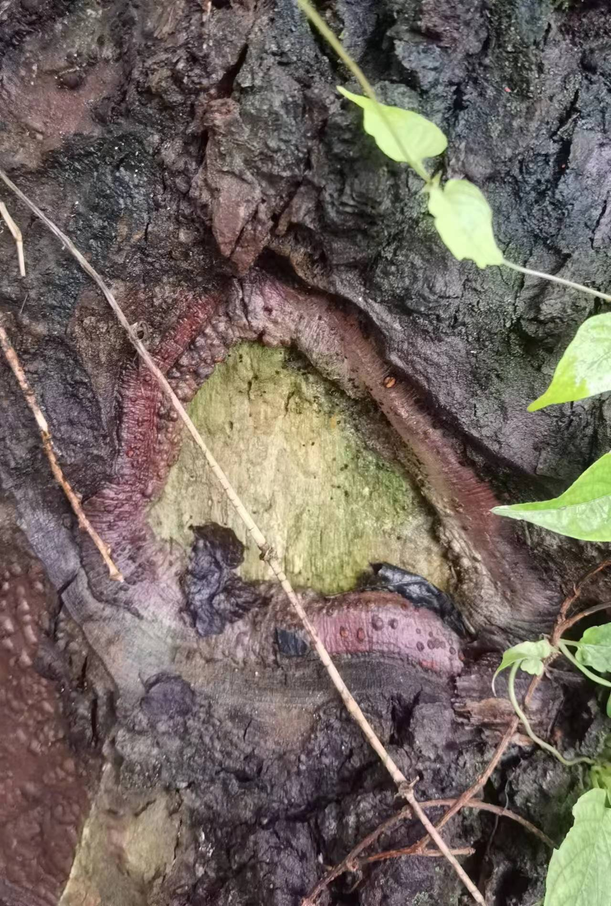
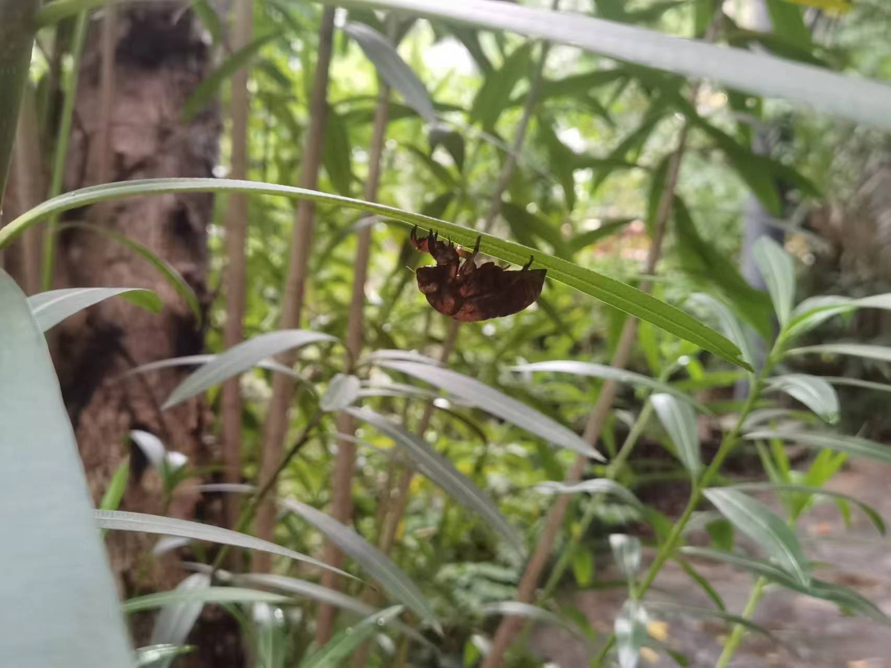
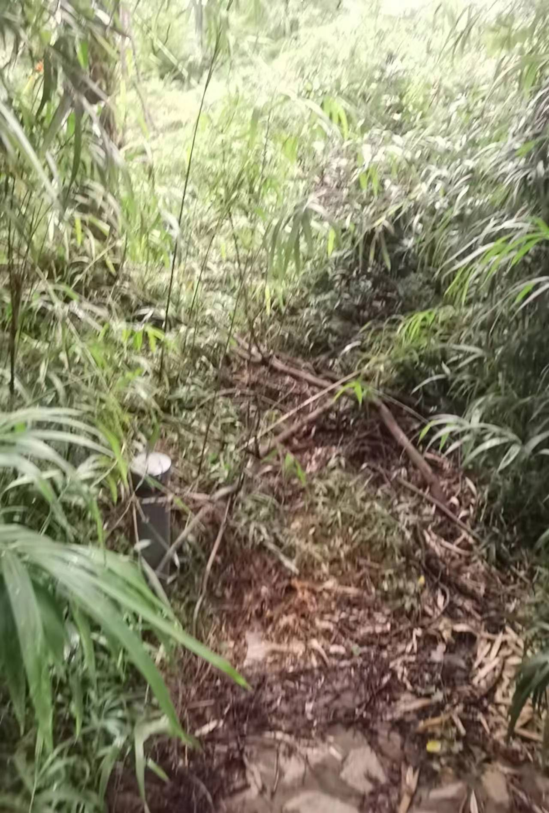
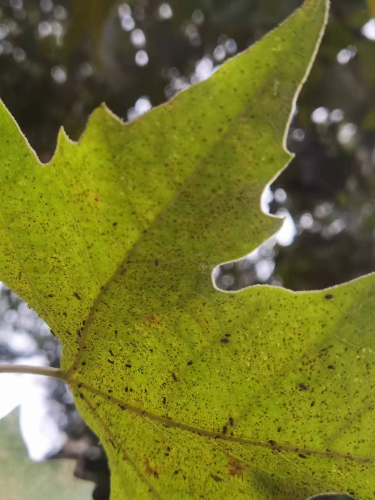

# Nature exploration

## Assignment's description
Engage in the deep observation of the ecosystem, focusing on the perception of ecological relationships. Try to obtain a “change of scale”, analysing how the environment is perceived by all five senses. Look at relationships between elements rather than single entities. Discuss and describe your findings with sketches, maps, text, etc. This activity may be repeated a few times during the course.

## Documentation
I go to the Sanhaowu with my phone and a magnifier to find some inspiration.

When I enter there I see a cat nest. I think maybe some cat lovers put the nest there.

After I enter Sanhaowu,first I feel the cool and fresh air,I think the comfortable air comes from trees,grass,and the river.

Then I turn my eyes to a flower,through the magnifier,in that flower,two ants crowl on it,I think there are nectar and dew atttract them. And I see a maggot twist its body in the flower.

I find a little white mushroom in the green,and in that position,I close my eyes and try to hear and smell,I can hear chirping of cicada,I record it because it is so unique at the junction of the quiet and noisy.I can smell the grass or leaves,which is so fresh that I even want to taste it.

When I pass by a big tree,I find a hole on its trunk.I am curious about how it forms.

While I was walking in the little forest,suddenly I saw a cicada below a leaf,I think it is just a shell because it doesn't move.And maybe it just molted.

In the middle of the forest,some trees and weeds hamber the road.

Before I leave SanHaowu,I notice some leaves along the river,the font side of these leaves are normal,but the back side of them exsist a lot of spots,but through the magnifier,I think these spots are some tiny bugs.

bullet point list
* item one
* item two
* item three

numbered list
1. item one
2. item two
3. item three

**bold text**
