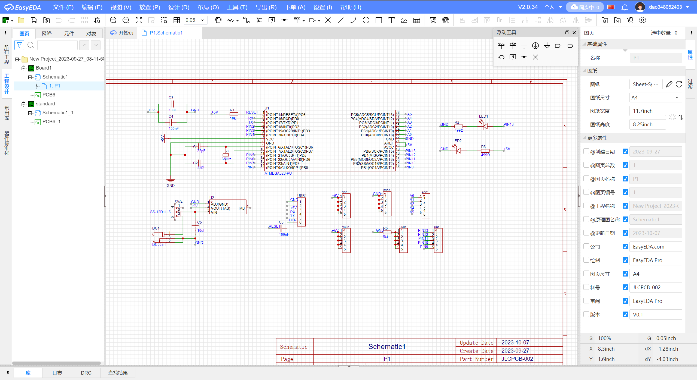
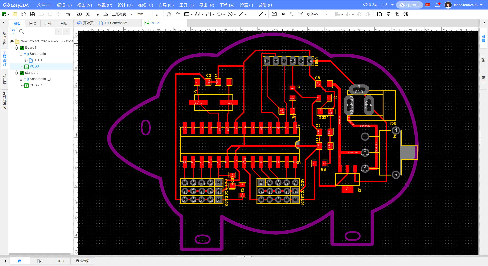
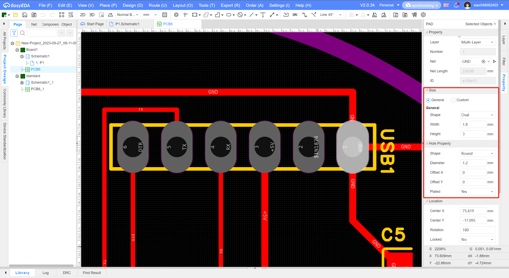
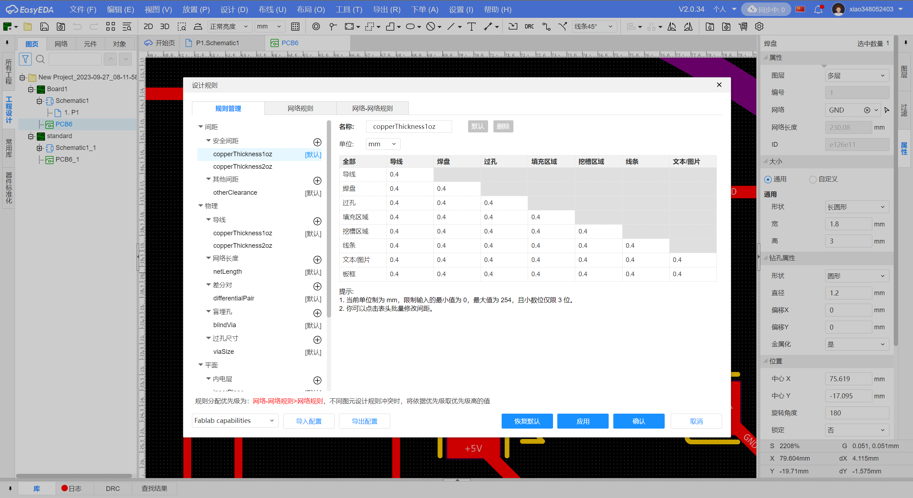
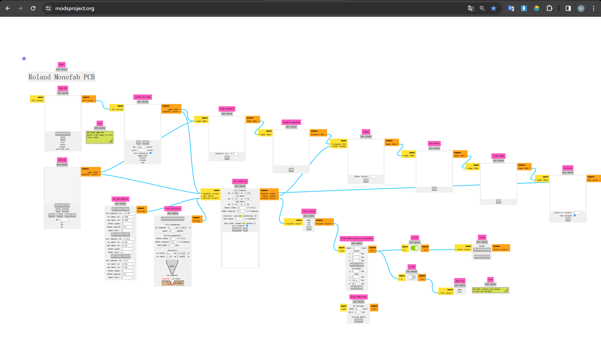
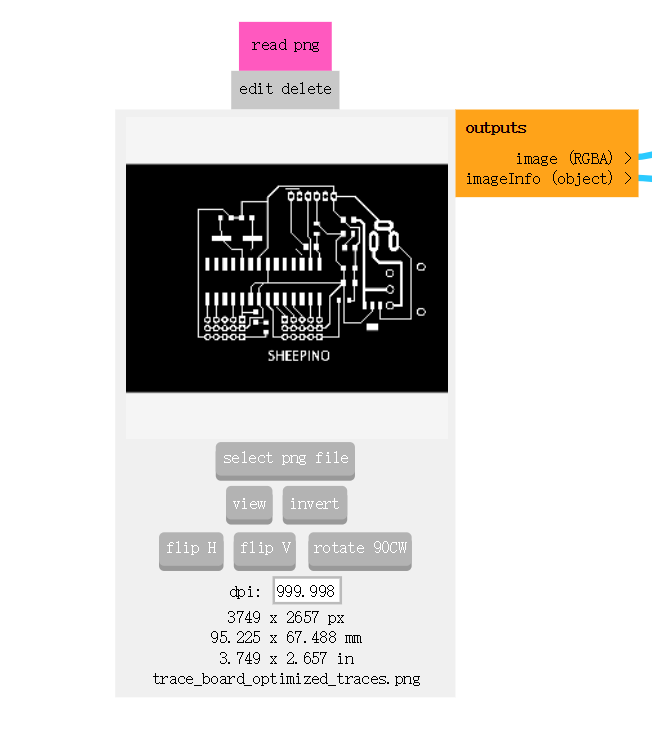
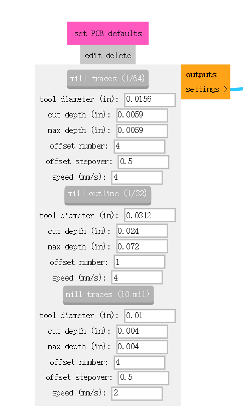
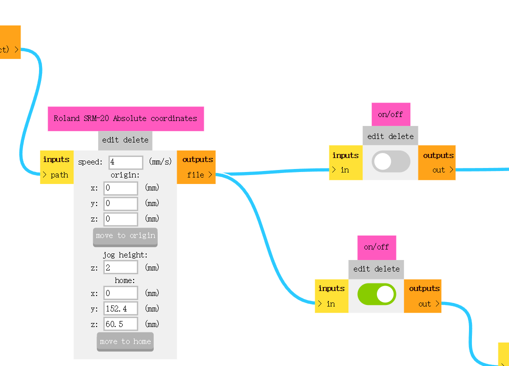
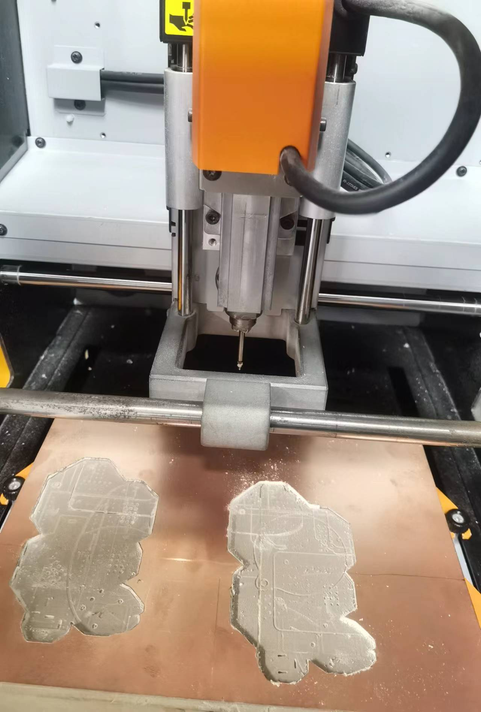
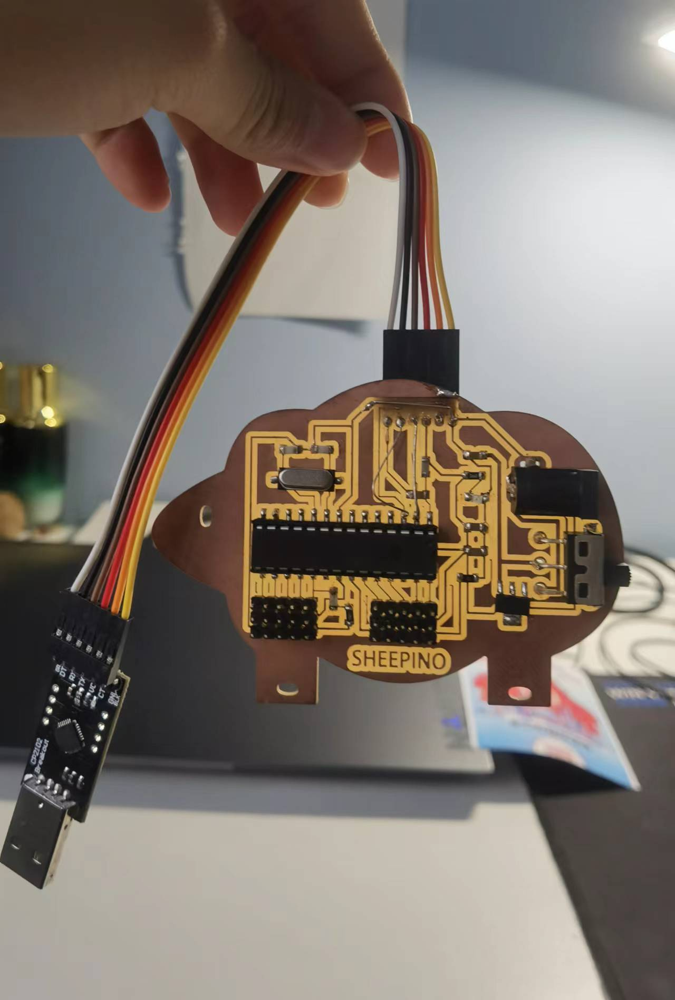

# cncmilling
## Assignment's description
Have the first try of PCB totally by yourself,from design to milling,welding,testing.Open the door to the real PCB design.

## Documentation
To finish the first PCB design work,I learn the application EasyEDA to design the board and connect circuit;I use the milling machine to cut the board;I weld the components to the board;I test my board by uploading the code from my computor.

bullet point list
* item one
* item two
* item three

numbered list
1. Design the board on EasyEDA

   First we add the components we need,then we define VCC and GND and we use wire to connect components,or we can name the wire and the same wire means they are connected.
   
   When we finish the schematic,we can change it to PCB.First the components are random so we should resort them.And we can see the blue line between any two components,which means a connection EasyEDA suggests.And we must eliminate all the blue lines by using wire so that we can continue next step.And we can make a shape of the board.
   
   It is worth to mention that if we want to weld the components easily we should change the footprint.
   
   Remember to change the design rule,because the minimum size of our milling knife is 0.4mm,so we change the values to 0.4.
   
   When we finish the design of the board,we can export the file for cutting,we choose single PDF page and tick the top layer,board outline layer and hole layer.

   Then we use adobe illustrate to transfer the PDF to three picture:trace,outline and hole.
   
2.Preparing for cutting

  We use the website to transfer the three pictures to cutting file.
  
  Select the picture.
  
  Choose the knife.
  
  Adjust the origin x,y,z and change the button of save.
  

3.Cut the board

  We make sure the knife is 0.4mm and we cut trace at first,and we locate the x,y,z of the machine,after cutting trace we change the knife to 0.8mm and locate z again,then cut the hole and outline.After cutting we pick it off and polish it.
  

4.Weld the Sheepino

  We use the iron to weld components onto the board.And that's my board--Sheepino.
  

**bold text**

*italic text*

***italic and bold text***

example of an external link

[description of the website](https://www.https://www.example.com/)

example of a picture hosted on an external website

example of a picture hosted inside your repository (don't forget the ./ operand)

