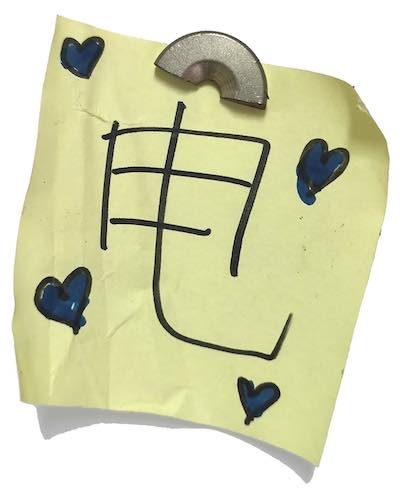

# cncmilling
## Assignment's description
Have the first try of PCB totally by yourself,from design to milling,welding,testing.Open the door to the real PCB design.

## Documentation
To finish the first PCB design work,I learn the application EasyEDA to design the board and connect circuit;I use the milling machine to cut the board;I weld the components to the board;I test my board by uploading the code from my computor.

bullet point list
* item one
* item two
* item three

numbered list
1. item one
2. item two
3. item three

**bold text**

*italic text*

***italic and bold text***

example of an external link

[description of the website](https://www.https://www.example.com/)

example of a picture hosted on an external website

example of a picture hosted inside your repository (don't forget the ./ operand)

