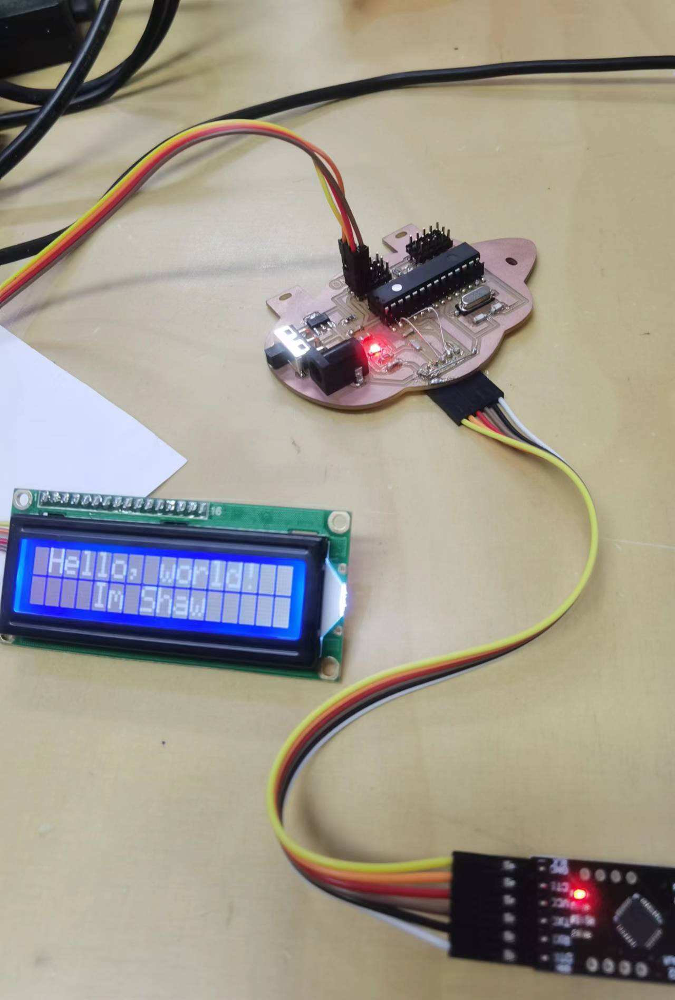
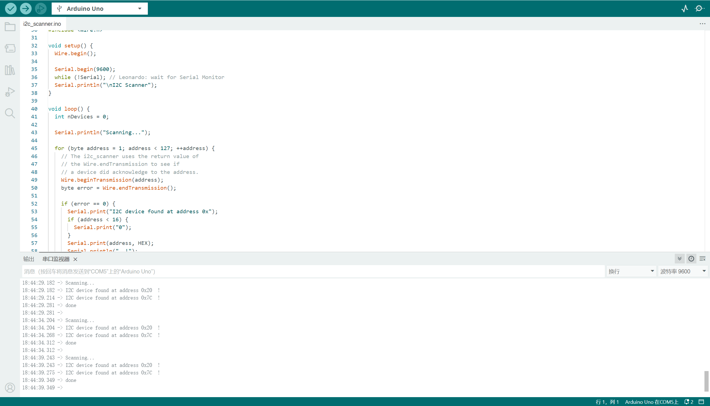

# Output devices try-out

## Assignment's description
Describe the assignment

## Documentation
Describe the work you did to complete the assignment

bullet point list
* Use my board to control some output device
1. Control the lcd screen
   
   
   We use the example code from Arduino IDE,First we use the code"I2c scanner" to see the address of the lcd
   
   We can see the address of the lcd is"0*20",so we change the address.
   
   Use the code to control the lcd,the first number is the start position of the string and the second number is the line of the string.
   ```
   lcd.backlight();
   lcd.setCursor(1,0);
   lcd.print("Hello, world!");
   lcd.setCursor(4,1);
   lcd.print("Im Shaw");
   ```
   Use the code to clear the screen
   ```
   lcd.clear();
   ```
3. Control the servo motor
 

**bold text**

*italic text*

***italic and bold text***

example of an external link

[description of the website](https://www.https://www.example.com/)

example of a picture hosted on an external website


example of a picture hosted inside your repository (don't forget the ./ operand)


