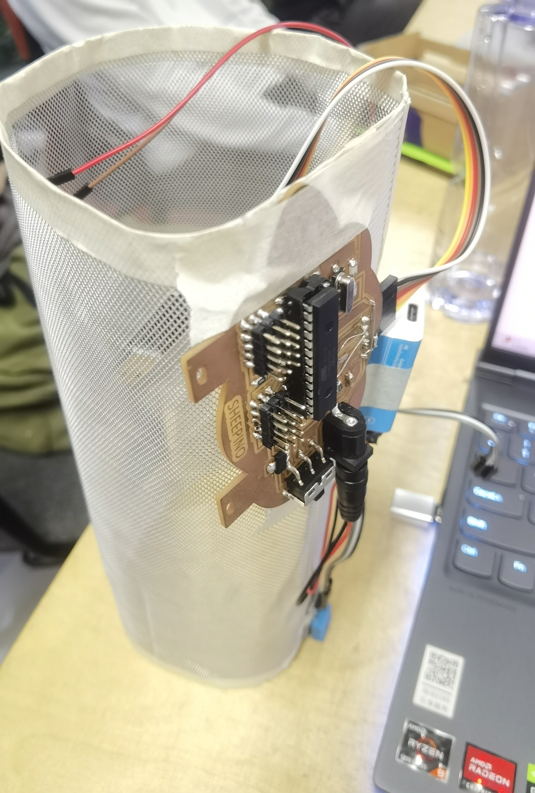

# Prototyping

## Assignment's description
To make a quick prototyping to Assist in the design of the final project

## Documentation
I use the wire net to make a cylinder with my sheepino and the sensor and fans

That means I want to create an area to let people in this area feel the smell of plants
