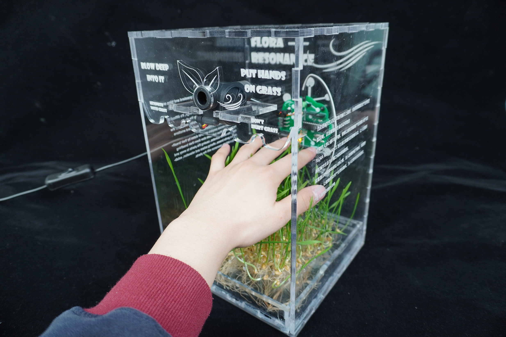

# Finalproject

## Assignment's description
After eight weeks learning and exploration,we finally finish the project
## Documentation

**Inspiration**

The initial inspiration came from a visit to the Youth Forest Park. As I lay on a grassy field, closing my eyes to immerse myself in the surroundings, I felt the air around me growing cooler. After conducting research, I discovered that part of the reason for the cooler air was the plant's life activities causing a localized temperature drop, creating subtle air currents. Another reason was the gradual tranquility of the mind after interacting with plants, establishing a resonance.
Hence, I created this installation with the aim of fostering an understanding of the connection between the essence of plants and the human spirit.

**Design description**

**自然共鸣**旨在通过装置化的植物互动，让人们重新感知城市生态与心情之间的深刻联系。装置通过呼吸频率感知人的心情，当人放慢呼吸节奏时，装置便会启动，让植物摆动并产生柔和微风，为人们带来安抚和放松，产生与植物的微妙共鸣

**FLORA RESONANCE** aims to allow people to rediscover the profound connection between urban ecology and emotions through interactive plant installations. The system senses people's emotional states by their breathing frequency. When individuals slow down their breathing rhythm, the device activates, causing the plants to sway and create a gentle breeze, offering solace and relaxation, establishing a delicate resonance with the plants.

**Design process**

**1.PCB design**
I design the PCB on the website [JLC]([[https://www.https://www.easyeda.com/](https://u.easyeda.com/join?type=project&key=e5bc68bd89fe7736b408419208a81734&inviter=0b2f2d0728e34afbad0e878310027419)]

The schematic picture of my PCB


**2.Soldering the PCB**

The board delivered from factory

The board soldered by myself


**3.Device design**
Start with some sketchs

Make an iteration of two versions
\
The final laser cutting file

Use acrylic to assemble my device

Plant some grass in my device

Consolidate the device

The outcomes


Interact with the device


**4.Coding**
```
volatile int flow_frequency; // Measures flow sensor pulses
int blowTime = 0;
float l_sec; // Calculated litres/hour
unsigned char flowsensor = 2; // Sensor Input
unsigned long currentTime;
unsigned long cloopTime;
long cm, inches;
void flow () // Interrupt function
{
   flow_frequency++;
}
void setup()
{
   pinMode(9,OUTPUT);
   pinMode(flowsensor, INPUT);
   digitalWrite(flowsensor, HIGH); // Optional Internal Pull-Up
   Serial.begin(9600);
   attachInterrupt(0, flow, RISING); // Setup Interrupt
   sei(); // Enable interrupts
   currentTime = millis();
   cloopTime = currentTime;
}
void loop ()

{
   currentTime = millis();
   // Every second, calculate and print litres/hour
   if(currentTime >= (cloopTime + 400))
   {
      cloopTime = currentTime; // Updates cloopTime
      // Pulse frequency (Hz) = 7.5Q, Q is flow rate in L/min.
      l_sec = (flow_frequency * 1 / 7.5); // (Pulse frequency x 60 min) / 7.5Q = flowrate in L/hour
      flow_frequency = 0; // Reset Counter
      if(blowTime <= 16)
      {
        if(l_sec > 2)
        {
          blowTime = blowTime + 1;
        }
      }
      else
      {
        digitalWrite(9,HIGH);
        delay(16000);
        blowTime = 0;
        digitalWrite(9,LOW);
      }
      Serial.print(l_sec, DEC); // Print litres/hour
      Serial.println(" L/s");
      Serial.println();
   }
}
```
